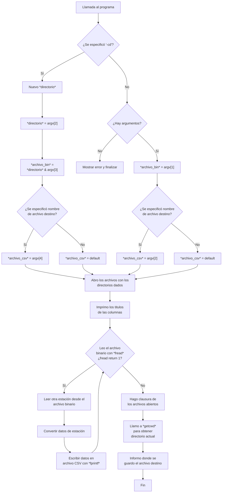

# Entregable Práctica 0

## Indice

- [Introducción](#introducción)
- [Enunciado](#enunciado-del-ejercicio)
- [Interpretación](#interpretación-del-problema)
- [Librerías](#librerías-incorporadas)
- [Solución](#solución)
- [Detalle del Programa](#desglose-del-programa)
- [Modo de uso](#modo-de-uso)
- [Diagrama de flujo](#diagrama-de-flujo)

## Introducción

Mediante el presente documento, se expone el trabajo realizado para la solución del ejercicio _entregable_ perteneciente a la práctica 0. Para su realización, se desglosa el proceso llevado a cabo en la presentación de la consigna de dicho problema, seguido por la interpretación que se realiza de la misma, los tipos de datos a manejar, y el enfoque que se le dará a la solución. El programa sintetizado será analizado y explorado, de manera tal de informar las claves de su funcionamiento, junto con la sintaxis de sus argumentos y el modo de uso del mismo. Finalmente, se finaliza con la exposición de la bibliografía utilizada, junto con las referencias ordenadas por aparición de las mismas.

## Enunciado del ejercicio

Una serie de estaciones meteorológicas automáticas, transmiten los datos recogidos a una computadora, donde se agrupan y almacenan como un archivo binario. Los datos están almacenados como estructuras en el archivo binario de la siguiente manera:

```
UINT32 Identificación de estación
UINT16 Presión *10 (milibares)
INT16 Temperatura *10 (grados centígrados)
UINT16 Precipitaciones caídas*10 (milímetros)
UINT8 humedad relativa ambiente en %
UINT32 Fecha y Hora de medición, en segundos contados desde
las 00:00 hs del 01/01/2000.

```

Se quiere escribir un programa para leer el archivo binario y convertirlo a un archivo de texto tipo CSV que con los siguientes campos separados por comas y en el orden especificado:

- Identificación de estación como un número entero.
- Fecha de Medición en formato **dd/mm/yyyy**.
- Hora de medición en formato **hh:mm:ss**.
- Temperatura en formato **TT.t** (**TT** grados, **t** décimas de grado).
- Presión en formato **PPPP.p** (**PPPP** milibares, p decimas de milibar).
- Precipitaciones caídas en formato **zzz.u** (**zzz** milimetros **u** décimas de milímetro)
- Humedad relativa ambiente en formato **vvv** (porcentaje)
- Existe una restricción de memoria que hace que no pueda almacenarse más que el contenido de una línea a la vez (No se puede leer todo el archivo en memoria y luego procesarlo).
- Para realizar pruebas, pueden utilizar el archivo **datos.bin** disponible en el moodle de la materia.

## Interpretación del problema

A partir del enunciado previamente expuesto, se comprende por objetivo principal lograr escribir un programa en lenguaje c, capaz de leer un archivo de tipo binario del cual se conoce como está escrito y estructurado, de manera tal que dicha información sea suficiente para poder convertirlo a un archivo tipo **_comma-separated value_** o **_csv_**, que respete el orden establecido separado por columnas. De esta manera, se procede a establecer como _interfaz programa-usuario_ la **terminal de comandos**, y será a través de la línea de comandos de la misma donde se interactúa con el programa, entregandole los archivos (en realidad, los directorios de los mismos) como argumentos para que este funcione. Para lograr una mayor independecia en cuanto a la ubicación en donde se encuentra el archivo origen (el archivo binario), se dispondrán 2 modos de funcionamiento. Por un lado, se podrá pasar como argumento únicamente el nombre del archivo origen y el nombre del archivo destino o resultante. Este modo implica la ubicación del archivo binario en el mismo directorio desde donde se ejecuta el programa. Sin embargo, el segundo modo de direccionamiento intenta suplir esta restricción, de manera que podrá establecerse el directorio en donde se encuentra el archivo binario, su nombre y el nombre del archivo resultante nuevamente.
En cuanto a los datos que se presentan en el enunciado, almacenados en el archivo _.bin_, se puede inferir que son en su mayoría de tipo _entero sin signo_, declarados en la biblioteca estándar de C[^2]:

- **_uint32_t_**: Son los datos de ID, y Fecha y Hora de la medición. Son datos sin signo, por o que su rango va desde 0 a 4.294.967.295, ya que es un datos de 4 bytes.
- **_uint16_t_**: Son los datos de presión, Precipitaciones caidas y Temperatura. Al igual que aquel de 32 bits, representa una variable sin signo, por lo que su rango va desde 0 a 65.535, siendo de 2 bytes.
- **_uint8_t_**: Por último la humedad relativa en el ambiente, se almacena en un tipo de dato sin signo, de 1 byte, cuyo rango va desde 0 255.

Cabe destacar que aquellos valores en **_uint16_t_** son en realidad variables de tipo _float_, pero que fueron amplificados en 10 veces, de manera tal que la parte decimal del dato (el primer decimal), quede incluido en la parte real del dato escrito. Es por ello que al leer este dato en el binario, si se lo quiere reprensentar fielmente en el **_csv_** se deberá dividir por 10 el mismo, para recuperar esa parte fraccionaria.
Por su parte, se entiende que, siendo cada dato del binario correspondiente a una estructura ordenada, al realizar la lectura, se deberá retener en memoria los 15 bytes que pertenecen a una única estación, de manera de luego poder ordenar dicha informacion en la estructura propia del programa.

## Librerías incorporadas

Cabe destacar, antes de comenzar con la solución del problema, el variado uso de librerías que se hizo en el desarrollo del programa. Por un lado, encontramos típicamente **_stdlib.h_** y **_stdio.h_**, encargadas de contener las funciones destinadas a la gestión de memoria dinámica, conversión de tipos de datos y funciones matemáticas básicas en el caso de la primera; y las funciones de entrada y salida de datos a través de archivos, consola, etc., en el caso de la segunda. En el caso de **_string.h_**, esta se utiliza para el manejo del tipo de dato de cadenas de caracteres. Proporciona así, funciones que permiten trabajar con estas cadenas de manera eficiente y rápida. **_stdbool.h_** por su parte, se incluye para poder contar con las definiciones necesarias para el uso de variables de tipo _booleano_. Se incorpora **_time.h_**[^1], librería fundamental para gestionar y manipular tiempo y fechas, aportando tanto funciones (_locatime()_, _gmtime()_, entre otras) para su manejo, como también estructuras importantes para su uso. Por último, **_unistd.h_** y **_limits.h_** se utilizan únicamente con el propósito de utilizar la función _getcwd()_ para poder obtener el directorio donde se encuentra el ejecutable, de manera independiente y flexible de quien o donde se acciona el programa.

## Solución

El principal objetivo del programa implementado es la creación y conversión de un archivo tipo **_.csv_** a partir de un archivo origen de tipo binario. La solución obtenida carece como primer límite, de la generalización en su uso como "traductor" entre el archivo binario y _csv_, ya que logra su objetivo correctamente solo para los archivos binarios en los que sus datos se encuentren ordenados y dispuestos de la forma previamente establecida (mediante la consigna). A partir de dicha restricción, se propuso obtener una mayor libertad en la indicación de la ubicación del archivo binario, el cual no necesariamente se piensa que estará en la carpeta contenedora del _script_ solución.
Dado que se seleccionó la _terminal_ como la interfaz de interacción usuario-programa, todos los datos que le deben ser provistos al programa deben ser dados mediante argumentos por la consola de comando, o preestablecidos previamente.
A partir del enfoque previo, se construyó la solución obtenida,la cual posee por ello, 2 modos de funcionamiento:

1. El modo de uso más sencillo, ya que únicamente se entrega como argumento el nombre del archivo binario de origen (con la extensión **_.bin_** incluída), y luego el nombre del archivo **_.csv_** destino que se creará, siendo en este caso innecesario la adición de su extensión, ya que el propio programa contiene un pequeño módulo para la adición de la misma. La incorporación de este último argumento es a su vez prescindible, ya que en caso de no estar informado, se procedea crear el archivo **_.csv_** mediante un nombre _default_, informado mediante la terminal. Cabe declarar, como restricción de este modo de empleo, que el archivo **_.bin_** debe estar contenido dentro de la carpeta que contiene al archivo ejecutable del programa. El directorio donde se guardará el archivo destino está fijado para cualquier caso en la carpeta contenedora del ejecutable del programa. De esta manera, la sintaxis para el primer modo de funcionamiento es el siguiente:

```bash
.\programa.o archivo.bin archivo
```

2. El segundo modo de funcionamiento establece mayor libertad a la hora de manejar el archivo binario de origen al programa, ya que permite cambiar el directorio donde buscar este archivo. Para el acceso a este modo de funcionamiento, se debe declarar como primer argumento al llamar al programa la sintaxis _'-cd'_, correspondiente a _change directory_. Luego se deberá incorporar el directorio del archivo binario en el formato _/carpeta-ppal/carpeta-contenedora/_, siendo prescindible el agregado de la última _/_ ya que el programa mismo se encarga de incluirla en caso de faltar. Como tercer argumento se debe incluir el nombre del archivo binario, con su extension incluida. Por último, el último argumento consta del nombre que recibirá de el archivo **_.csv_** , el cual no debe inluir la extensión del mismo, e incluso es prescindible el nombre en si, ya que en caso de faltar este argumento, el archivo se creará bajo un nombre _default_, informado mediante la terminal.
   El directorio donde se creará el archivo destino está fijado para cualquier caso en la carpeta que contiene el ejecutable del programa. La sintaxis para este modo de uso es:

```bash
.\programa.o -cd /carpeta-ppal/carpeta-contenedora/ archivo.bin archivo
```

## Desglose del programa

Para un manejo eficiente y sencillo de los datos presentes en el archivo binario, se crea la estructura _estacion_met_ mediante el uso del _typedef_, incluyendo dentro de la misma todos los datos que son recabados de cada estación meteorológica. Esta estructura es de especial interés ya que es el objeto principal en la escritura al archivo **_.csv_**.

```c
typedef struct
{ // Estructura donde se almacenarán los datos de cada estación igualmente estructurados en el archivo .bin
    __uint32_t id_estacion;
    __uint16_t presion;
    __int16_t temp;
    __uint16_t precip_caidas;
    __uint8_t hum;
    __uint32_t time;
} estacion_met;
```

Inmediatamente luego se chequea el pedido de cambio de directorio por parte del usuario, al revisar el primer argumento pasado por linea de comandos. En caso afirmativo, la _"bandera"_ booleana _cambio_directorio_ resulta positiva y se decide el modo de uso del programa.

```c
if (argv[1] && strcmp(argv[1], "-cd") == 0){ //Verifico que argv[1] sea no NULL y que sean iguales este con "-cd" (strcmp daría 0)
        cambio_directorio = true;}
```

##### Cambio de directorio es solicitado

En caso de que se introduzca _-cd_ como primer argumento, se desarrolla la lógica asociada a este modo de funcionamiento. Para ello, usando memoria dinámica (ya que se ignora el tamaño de la cadena de caracteres que introducirá el usuario), se copia en la variable _directorio_, el contenido del primer argumento. Comprobándose además la incluión de la "/" final.

```c
directorio = malloc(strlen(argv[2]) + 2); // solicito memoria dinámica necesaria para que quepa argv[2] + '/' y '\0'
        strcpy(directorio, argv[2]);              // Copio argv[2] en directorio.
        size_t len = strlen(directorio);          // Calculo la congitud de sirectorio (con \0)
        if (directorio[len - 1] != '/')           // Chequeo si se introdujo el '/' al final del argv[2].
        {
            directorio[len] = '/';      // Agrego '/'
            directorio[len + 1] = '\0'; // Agrego el carácter de fin de cadena
        }
```

Luego se chequea por errores, como que no se incluya el nombre del archivo binario, o el del archivo destino, caso en el cual se activa la bandera booleana _archivo_csv_default_, que indica si se utilizará un nombre default o el indicado por el usuario en el argumento 4.

```c
if (argc < 4)
        { // Lógica de control de errores por pasaje de argumentos insuficientes
            perror("No se especificó la ruta del archivo bin origen");
            free(directorio);
            return 1;
        }
        else if (argc == 4)
        {
            printf("El archivo CSV se guardará en el directorio del programa como estaciones_met.csv\n");
            archivo_csv_default = true;
        }
```

De la misma manera que con _directorio_, se guarda memoria dinámica para la variable que contiene el nombre del archivo binario, _archivo_binario_, y se le copia el contenido de _directorio_ concatenado con el nombre asignado en el tercer argumento.

```c
archivo_binario = malloc(strlen(directorio) + strlen(argv[3]) + 1);
strcpy(archivo_binario, directorio);                                // Concateno el directorio default y lo pasado por el usuario en una sola cadena
strcat(archivo_binario, argv[3]);
```

Y por último, se decide el nombre del archivo **_.csv_**, mediante la lógica de si se explicitó un nombre o se usa el default.

```c
if (archivo_csv_default)
    { // Lógica para decidir el nombre con el cual guardar el .csv (default o por usuario)
    archivo_csv = malloc(strlen("estaciones_met.csv") + 1);
    strcpy(archivo_csv, "estaciones_met.csv");
    }
else
    {
    archivo_csv = malloc(strlen(argv[4]) + strlen(".csv") + 1);
    strcpy(archivo_csv, argv[4]);
    strcat(archivo_csv, ".csv");
    }
```

##### Sin cambio de directorio

En este caso, se debe de la misma manera que en anterio, resolver los nombres (o directorios) de los archivos, binario y _comma-separated value_. En este modo, el camino es más sencillo y por ende más corto, ya que se debe completar solo con los dos argumentos (o 1) que proporciona el usuario, de manera tal que, primero se controle que existen los argumentos suficientes (o sea, al menos, el nombre del archivo binario), y luego si el nombre del archivo destino no se informa, nuevamente se activa la bandera _archivo_csv_default_.

```c
if (argc < 2)
    { // Lógica de control de errores por pasaje de argumentos insuficientes
    perror("No se especificó el archivo .bin origen");
        return 1;
    }
else if (argc == 2)
    {
    printf("El archivo CSV se guardará en el directorio del programa como estaciones_met.csv\n");
    archivo_csv_default = true;
    }
```

Luego se completa el contenido de la variable _archivo_binario_ con lo explicitado en el argumento 1, con la misma lógica de la memoria diámica que antes.
Para _archivo_csv_ se realiza lo mismo que en el caso anterior, solo que cambia el argumento a el segundo en este caso (si está presente).

##### Escritura del archivo .csv

Una vez que están listas todas las variables para manejar los archivos de interés, se procede a abrir estos mismos, en modo escritura para el archivo destino, y modo lectura binaria para el archivo origen. Se incluyen las lógicas en caso de haber un error en la apertura de cualquiera de los dos archivos.

```c
bin = fopen(archivo_binario, "rb"); // Abro el archivo binario (con lo explicitado previamente) en modo lectura especifica para binario
    if (bin == NULL)
    { // Lógica para error en la apertura del archivo binario
        perror("Error al abrir archivo_binario");
        free(archivo_binario); // Debo liberar la memoria din. previamente solicitada
        return 1;
    }

csv = fopen(archivo_csv, "w");
    if (csv == NULL)                     // Lógica por si no se logra abrir el csv
    {
        perror("Error al abrir el archivo binario origen");
        free(archivo_csv);
        return 1;
    }                   // Lógica por si no se logra abrir el csv
```

Es entonces que se efectúa la escritura del archivo destino. Primero se agregan los nombres para las columnas a escribir.

```c
fprintf(csv, "%s,%s,%s,%s,%s,%s,%s\n", "ID Estación", "Fecha", "Hora", "Temperatura", "Presión", "Precipitaciones", "Humedad"); // Escribo el header de las columnas en el .csv

```

Luego, mediante una estructura _while_, se ejecuta la estrategia de lectura y escritura entre archivos, de manera que la variable de desición es el valor de retorno de la función _fread()_.

```c
fread(&estacion, sizeof(estacion_met), 1, bin)
```

Esta última recibe un puntero a la variable _estacion_. Al usar la dirección de memoria de _estacion_, se permite que _fread_ escriba los datos leídos directamente en esa ubicación de memoria. Luego se indica cuántos bytes se van a leer desde el archivo binario. En este caso, _sizeof(estacion_met)_ devuelve el tamaño de la estructura _estacion_met_, lo cual es muy importante ya que resuelve la restricción de memoria que hace que no pueda almacenarse más que el contenido de una línea a la vez, o sea que no se puede leer todo el archivo en memoria para luego procesarlo. De esta manera se indica una cantidad de bytes correspondientes a los datos obtenidos de una única estción metereológica. Luego, el argumento _'1'_ indica la lectura de un solo bloque de este tipo cada vez que se llame a a función _fread_. Es decir se lee una estación por iteración. Por último, _bin_ es el puntero al archivo desde el cual se están leyendo los datos, abierto previamente con _fopen_.

Una vez leidos y guardados en estructura los datos, leen desde la misma estructura y se convierten a tipo **float**.

```c
float temperatura = estacion.temp / 10.0;
float presion = estacion.presion / 10.0;
float precip = estacion.precip_caidas / 10.0;
```

Para la lectura del dato temporal, que está medido en segundos contados desde
las 00:00 hs del 01/01/2000, se utiliza la estrutura específica de la bibiloteca **time.h** definida como _tm_. Para completar los datos de la misma se utiliza la función _localtime()_ [^3]la cual se utiliza para convertir un valor de temporal en segundos contados desde el 1 de enero de 1970 (Epoca UNIX)[^4], en una estructura que representa la hora local del sistema. Por eso se relativiza el tiempo de la estación metereológica a la fecha de la epoca UNIX, de manera que dicho resultado se le para a la función _localtime()_.

```c
__time_t tiempo_rel_UNIX = estacion.time + SEGUNDOS_2000_A_UNIX;
struct tm *tiempo = localtime(&tiempo_rel_UNIX);

```

Finalmente con _fprintf_ se realiza la escritura del archivo _comma-separated value_, pasando como argumentos todos los datos calculados y leidos del archivo binario.

```c
        fprintf(csv, "%u,%02d/%02d/%04d,%02d:%02d:%02d,%2.1f °C,%4.1f mbar,%3.1f mm,%u%%\n",
                estacion.id_estacion, tiempo->tm_mday, tiempo->tm_mon + 1, tiempo->tm_year + 1900,
                tiempo->tm_hour, tiempo->tm_min, tiempo->tm_sec, temperatura, presion, precip, estacion.hum);

```

Luego se efectúa el cierre de los archivos utilizados, asi como la liberación de memoria dinámica.

## Modo de uso

Para la correcta utilización del programa, debe incialmente compilarse el archivo *.c*, de manera que se debe utilizar el compilador _**gcc**_ para generar el ejecutable del programa. La sintaxis será la siguiente:
```bash
    gcc -c e9.c -o <nombre_del_ejecutable>
```
Una vez generado el ejecutable, se procede a llamar al programa según sus dos modos de funcionamiento:

1. Sin especificación de *'-cd'*
    
    Si no se especifica el cambio de directorio, entonces la sintaxis será:

    ```bash
        .\<nombre_ejecutable> <nombre_archivo_bin>.bin <nombre_archivo_destino>
    ``` 
Recordar que puede no especificarse el nombre del archivo destino, siendo establecido un nombre por *default* para el mismo.

2. Con especificación de *'-cd'*

    Al especificar el cambio de directorio se espera una sintaxis como la siguiente:

    ```bash
        .\<nombre_ejecutable> -cd <ruta_archivo_bin> <nombre_archivo>.bin <nombre_archivo_destino>
    ```
Recordar que es prescindible el nombre del archivo de destino, así como la última \ dentro de la ruta del archivo binario. Además el archivo destino se creará para cualquier caso en la carpeta que contiene el ejecutable del programa.

## Diagrama de flujo


## Referencias

[^1]: [Time.h Library](https://www.ibm.com/docs/es/i/7.5?topic=files-timeh)
[^2]: [Material teórico de la asignatura _Programacion E1201_](https://www1.ing.unlp.edu.ar/catedras/E0201/)
[^3]: [_locatime_ functionality](https://pubs.opengroup.org/onlinepubs/009695399/functions/localtime.html)
[^4]: [Conversor a UNIX](https://espanol.epochconverter.com/)
