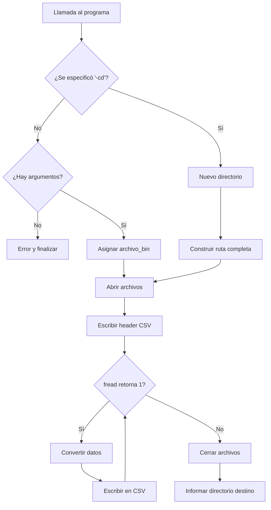

# Conversor de Datos Meteorológicos Binarios a CSV (Herramienta CLI en C)

Herramienta de línea de comandos desarrollada en lenguaje C para convertir datos meteorológicos almacenados en formato binario estructurado hacia un archivo de texto tipo CSV.

Este proyecto demuestra:

- Lectura y parsing de archivos binarios mediante estructuras (`struct`)
- Procesamiento eficiente bajo restricción de memoria (una estructura por iteración)
- Manejo de memoria dinámica
- Parseo de argumentos por línea de comandos
- Normalización de timestamps (época 2000 → época UNIX)
- Gestión robusta de archivos
- Generación formateada de archivos CSV

---

## Índice

- [Descripción General](#descripción-general)
- [Especificación del Formato Binario](#especificación-del-formato-binario)
- [Interpretación del problema](#interpretación-del-problema)
- [Librerías incorporadas](#librerías-incorporadas)
- [Solución](#solución)
- [Desglose del programa](#desglose-del-programa)
- [Modo de uso](#modo-de-uso)
- [Diagrama de flujo](#diagrama-de-flujo)
- [Referencias](#referencias)

---

## Descripción General

El programa implementa un conversor de datos meteorológicos almacenados en formato binario estructurado hacia un archivo CSV.

El diseño está orientado a:

- Procesamiento eficiente de archivos potencialmente grandes sin carga completa en memoria.
- Conversión precisa de datos escalados (valores almacenados multiplicados por 10).
- Manejo correcto de timestamps definidos desde una época distinta a la UNIX.
- Interfaz flexible mediante línea de comandos.
- Independencia del directorio del archivo fuente.

Se trata de una herramienta CLI completamente funcional, desarrollada exclusivamente con librerías estándar del lenguaje C.

---

## Especificación del Formato Binario

Los datos del archivo binario están organizados como estructuras consecutivas con el siguiente layout:

```
UINT32 Identificación de estación
UINT16 Presión *10 (milibares)
INT16 Temperatura *10 (grados centígrados)
UINT16 Precipitaciones caídas *10 (milímetros)
UINT8  Humedad relativa ambiente en %
UINT32 Fecha y Hora de medición en segundos desde 01/01/2000 00:00:00
```

El programa asume que el archivo respeta exactamente esta disposición en memoria.

El archivo CSV generado contiene los siguientes campos:

- Identificación de estación
- Fecha (dd/mm/yyyy)
- Hora (hh:mm:ss)
- Temperatura (TT.t °C)
- Presión (PPPP.p mbar)
- Precipitaciones (zzz.u mm)
- Humedad (%)

### Restricción de diseño

El procesamiento se realiza bajo la restricción de no almacenar más de una estructura en memoria simultáneamente.

Esto implica un modelo de procesamiento basado en flujo (streaming), leyendo una estación por iteración mediante `fread()`.

---

## Interpretación del problema

A partir de la especificación del formato binario, el objetivo principal es implementar un programa en C capaz de:

1. Leer registros estructurados directamente desde un archivo binario.
2. Reconstruir correctamente los tipos de datos.
3. Reescalar valores almacenados como enteros multiplicados por 10.
4. Convertir timestamps desde época 2000 a época UNIX.
5. Exportar los datos en formato CSV correctamente formateado.

Se establece como interfaz usuario-programa la terminal de comandos.

El programa soporta dos modos de funcionamiento:

- Modo simple: archivo binario en el directorio actual.
- Modo extendido: especificación explícita de directorio mediante flag `-cd`.

En cuanto a los tipos de datos utilizados en el archivo binario, estos corresponden a tipos enteros sin signo definidos en la biblioteca estándar de C[^2]:

- **_uint32_t_**: Identificación de estación y timestamp.
- **_uint16_t_**: Presión y precipitaciones.
- **_int16_t_**: Temperatura.
- **_uint8_t_**: Humedad relativa.

Los valores almacenados multiplicados por 10 requieren reescalado posterior para recuperar la parte decimal.

---

## Librerías incorporadas

Se utilizan exclusivamente librerías estándar:

- **stdlib.h** y **stdio.h** para gestión de memoria y entrada/salida.
- **string.h** para manipulación de cadenas.
- **stdbool.h** para uso de variables booleanas.
- **time.h**[^1] para manejo y conversión de tiempo.
- **unistd.h** y **limits.h** para obtener el directorio actual mediante `getcwd()`.

---

## Solución

El programa implementa:

- Estructura `estacion_met` alineada con el layout binario.
- Validación de argumentos.
- Construcción dinámica de rutas.
- Apertura controlada de archivos.
- Procesamiento iterativo mediante `fread`.
- Conversión numérica y temporal.
- Escritura formateada con `fprintf`.

El procesamiento central se basa en:

```c
fread(&estacion, sizeof(estacion_met), 1, bin);
```

Esto permite cumplir la restricción de memoria leyendo una única estación por iteración.

### Conversión temporal

El timestamp almacenado representa segundos desde 01/01/2000.

Se convierte a época UNIX mediante:

```c
__time_t tiempo_rel_UNIX = estacion.time + SEGUNDOS_2000_A_UNIX;
struct tm *tiempo = localtime(&tiempo_rel_UNIX);
```

La función `localtime()`[^3] convierte segundos desde la época UNIX[^4] en una estructura `tm` con componentes de fecha y hora locales.

---

## Modo de uso

### Compilación

```
gcc main.c -o conversor
```

### Ejecución

Modo simple:

```
.\conversor datos.bin salida
```

Modo con cambio de directorio:

```
.\conversor -cd /ruta/datos/ datos.bin salida
```

Si no se especifica nombre de destino, se utiliza `estaciones_met.csv` por defecto.

---

## Diagrama de flujo



---

## Referencias

[^1]: [Time.h Library](https://www.ibm.com/docs/es/i/7.5?topic=files-timeh)  
[^2]: [Material teórico de la asignatura Programación E1201](https://www1.ing.unlp.edu.ar/catedras/E0201/)  
[^3]: [Funcionalidad de localtime](https://pubs.opengroup.org/onlinepubs/009695399/functions/localtime.html)  
[^4]: [Conversor a UNIX](https://espanol.epochconverter.com/)
